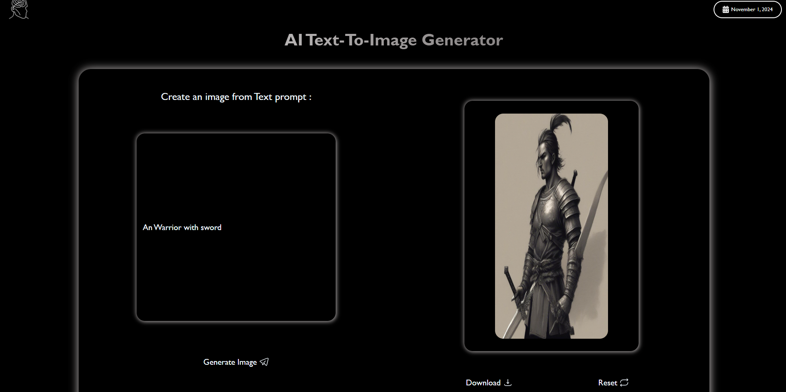
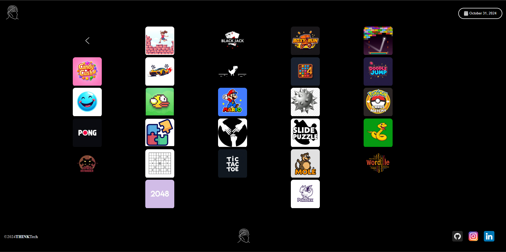
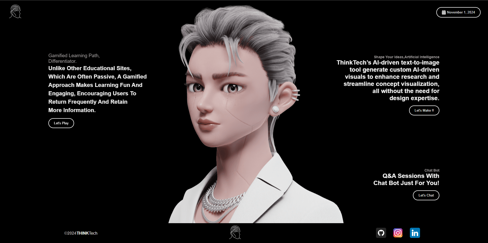

# ThinkTech

Welcome to **ThinkTech**, where innovation meets education! This platform offers **dynamic tools** designed to enhance research and learning experiences. With features like a virtual assistant, AI chat bot, and engaging games, ThinkTech empowers users to explore and visualize their ideas effectively.

Visit ThinkTech Website https://thinkthechh.netlify.app/


## Table of Contents
- [Features](#features)
- [Tool Descriptions](#tool-descriptions)
- [Installation](#installation)
- [Usage](#usage)
- [Contributing](#contributing)
- [License](#license)
- [Contact](#contact)

## Features 
- **Comprehensive Resource Retrieval:** Access research papers, articles, podcasts, and videos tailored to your topics of interest.
- **Virtual Assistant:** Get personalized help to streamline your research process.
- **AI Chat Bot:** Instant support for any questions you may have.
- **AI Text-to-Image Generator:** Visualize your ideas and download images easily.
- **Classic Games:** Enjoy a selection of nostalgic 90s games for relaxation.

## Tool Descriptions

### 1. Resource Retrieval 
Easily find relevant research papers, articles, and media sources to support your studies and projects.

### 2. Virtual Assistant 
A smart assistant to guide you through your research tasks, helping you stay organized and focused.

### 3. AI Chat Bot 
Available 24/7 to answer your questions and provide assistance with your research.

### 4. AI Text-to-Image Generator 
Transform your text ideas into visuals effortlessly, allowing for better presentations and reports.

### 5. Classic Games 
Unwind with classic games from the 90s, providing a fun break during your research sessions.


## Installation
1. Clone the repository:
   ```bash
   git clone https://github.com/yourusername/ThinkTech.git
   ```
2. Navigate to the project directory:
   ```bash
   cd ThinkTech
   ```
3. Run index.html:
   ```bash
   run index.html
   ```

## Usage
Explore the various tools available on the platform to enhance your research experience. Access resources, utilize the virtual assistant, and engage with our fun games!


## Contributing
We welcome contributions! If you’d like to improve the platform or add new features, please fork the repository and submit a pull request.

## License
This project is licensed under the MIT License - see the [LICENSE](LICENSE) file for details.

## Contact
For questions or feedback, please reach out to:
- **Apoorv Gupta**
- **Email:** apoorv041@gmail.com
- **GitHub:** [iapoorv01](https://github.com/iapoorv01)

---

Thank you for checking out ThinkTech! Together, we can transform the research experience. 🌟



---

