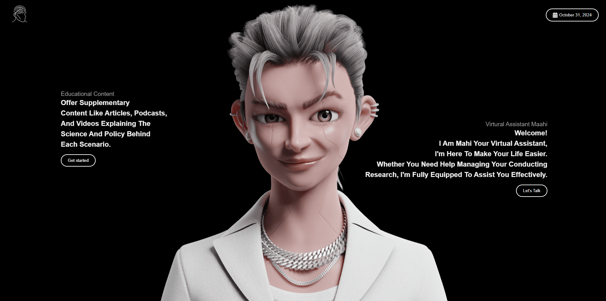
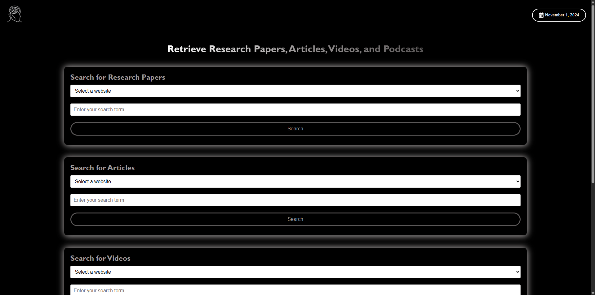

# ThinkTech

Welcome to **ThinkTech**, where innovation meets education! Our platform offers **dynamic tools** designed to elevate research and learning experiences. With features like a virtual assistant, AI chat bot, and engaging games, ThinkTech empowers users to explore and visualize their ideas effectively.

### 🌐 Visit ThinkTech: [https://thinkthechh.netlify.app/](https://thinkthechh.netlify.app/)


## Table of Contents
- [Features](#features)
- [Tool Descriptions](#tool-descriptions)
- [How ThinkTech Helps](#how-thinktech-helps)
- [Installation](#installation)
- [Usage](#usage)
- [Important Configuration](#important-configuration)
- [Contributing](#contributing)
- [License](#license)
- [Contact](#contact)

## Features 
- **Comprehensive Resource Retrieval:** Access tailored research papers, articles, podcasts, and videos.
- **Virtual Assistant:** Get personalized help to streamline your research process with voice interaction.
- **AI Chat Bot:** Instant support for your inquiries, available 24/7, providing quick summarization and assistance.
- **AI Text-to-Image Generator:** Easily visualize your ideas and download images to enhance your presentations.
- **Classic Games:** Enjoy nostalgic 90s games for a fun break during your research.

## Tool Descriptions

### 1. Resource Retrieval 
Effortlessly find relevant research materials to support your studies and projects.

### 2. Virtual Assistant 
A smart assistant that can work via voice commands, guiding you through your research tasks and keeping you organized.

### 3. AI Chat Bot 
Available around the clock to assist you with research-related questions and provide quick summaries of complex topics.

### 4. AI Text-to-Image Generator 
Transform your textual ideas into visuals, helping to shape and clarify your research concepts for better presentations and reports.

### 5. Classic Games 
Unwind with classic 90s games, providing a delightful break from intensive research.

## How ThinkTech Helps
ThinkTech serves as a comprehensive resource for researchers and students alike. It consolidates essential tools that simplify the research process:

- **Access to Previous Works:** Our platform allows users to quickly retrieve prior research, articles, and multimedia that are crucial for background studies.
- **Visual Idea Generation:** Use the Text-to-Image Generator to create visual representations of your research ideas, making it easier to communicate concepts effectively.
- **Rapid Assistance:** The AI Chat Bot offers quick summarization of topics, enabling students to grasp complex ideas swiftly without wading through extensive materials.
- **Organized Research Support:** The Virtual Assistant enhances productivity by providing tailored support, keeping users on track and ensuring they have the resources they need.

## Installation
1. **Clone the repository:**
   ```bash
   git clone https://github.com/yourusername/ThinkTech.git
   ```
2. **Navigate to the project directory:**
   ```bash
   cd ThinkTech
   ```
3. **Run index.html:**
   ```bash
   open index.html
   ```

## Usage
Explore the diverse tools available on the platform to enhance your research experience. Access resources, utilize the virtual assistant, and enjoy our engaging games!

## Important Configuration
Before using the application, please ensure to replace your API keys in the following files:
- **Text-to-image/script.js**
- **Chatbot/script.js**


## Contributing
We welcome contributions! If you’d like to enhance the platform or add new features, please fork the repository and submit a pull request.

## License
This project is licensed under the MIT License. See the [LICENSE](LICENSE) file for details.

## Contact
For questions or feedback, please reach out to:
- **Apoorv Gupta**
- **Email:** [apoorv041@gmail.com](mailto:apoorv041@gmail.com)
- **GitHub:** [iapoorv01](https://github.com/iapoorv01)

---

Thank you for exploring ThinkTech! Together, we can transform the research experience. 🌟


---
